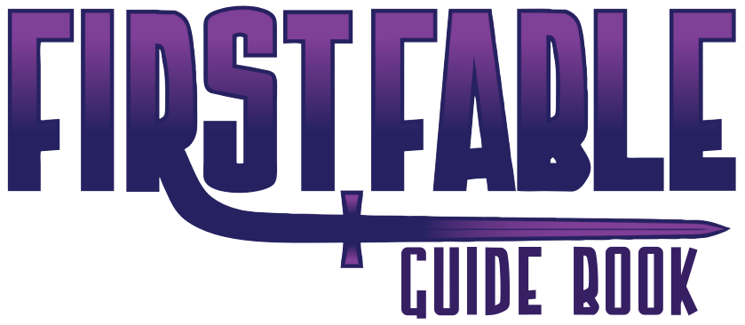

# Bienvenue à PremièreFable !

## Un jeu de rôles pour enfants de 8 à 12 ans

Si vous lisez cela, il y a de grandes chances que vous vouliez initier des enfants à la joie du jeu de rôles. Quand les joueurs de jeu de rôles deviennent plus vieux, qu'ils ont des enfants et qu'ils les voient grandir, il est naturel que nous voulions initier les personnes que nous aimons le plus au hobby que nous aimons le plus.

Mais est-ce réellement si simple ? Oui avec PremièreFable !

## Des règles simples et illustrées vous permettant d'être opérationnels en un temps record

Si vous êtes nouveau dans l'univers des jeux de rôles, commencez par lire cette page :

* [Qu'est-ce que le jeu de rôles ?](pages/01-Le-jeu-de-roles-en-deux-mots.md)

Le jeu est composé uniquement de trois chapitres, garnis de nombreux exemples :

* [Introduction](pages/02-Introduction.md)
* [Création des personnages](pages/03-Creation-des-personnages.md)
* [Règles du jeu](pages/04-Regles-du-jeu.md)
* [Gérer le déroulement du jeu](pages/05-Diriger-le-jeu.md)
* [Une conclusion sur le jeu](pages/07-Conclusion.md)
* [Contenu de la feuille de personnage](pages/09-fdp.md)

Le scénario d'introduction :

* [La chasse au Dahu sauvage](pages/06-La-chasse-au-Dahu-sauvage.md)

Pour les rôlistes aguerris, voir la synthèse du jeu faite par le traducteur :

* [Synthèse du jeu](pages/97-Synthese-du-jeu.md)

## Crédits

PremièreFable est une traduction du jeu américain pour enfants de 8 à 12 ans de _Matthew McFarland_, **FirstFable**. Le jeu original peut être trouvé gratuitement sur [DriveThruPRG](https://www.drivethrurpg.com/product/107399/FirstFable) ou sur [cette page](pages/08-FirstFable.md).

Il est disponible sous licence [Creative Common](http://creativecommons.org/licenses/by-nc-sa/3.0) ainsi qu'[ici](pages/LICENCE.md). La version française, traduite par Olivier Rey, est sous licence Creative Common, comme la version originale.

## Autres pages

* [Notes de traduction](pages/98-Notes-du-traducteur.md)
* [To do list](pages/99-To-Do-list.md) pour le traducteur
