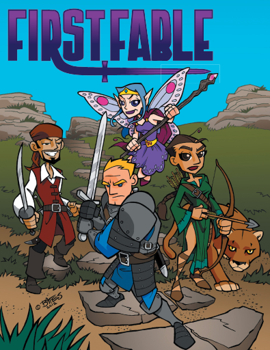

# Qu'est-ce que je jeu de rôles ?

Même si PremièreFable suppose que vous êtes un rôliste espérant initier vos enfants à votre hobby, il est aussi possible que vous ayez choisi ce jeu dans l'espoir de partager des bons moments avec vos enfants, mais que vous n'ayez jamais pratiqué aucun jeu de rôle.

Ne vous tracassez pas. Voici la version courte de ce que vous avez besoin de savoir.

## Le jeu

Tout d'abord, dans les jeux de rôles, les joueurs prennent les rôles de personnes d'histoires. Ils tentent d'accomplir les objectifs définis par l'histoire que vous êtes en train de raconter. Dans le scénario "[La chasse au Dahu sauvage](06-La-chasse-au-Dahu-sauvage.md)" [[1](98-Notes-du-traducteur.md#note1)], par exemple, le but de l'histoire est de poursuivre un animal mythique qu'aucune personne vivante n'a jamais vu auparavant.

Ensuite, la plupart des jeux de rôles (incluant PremièreFable) proposent un moyen de résoudre des défis incluant des éléments de hasard.Beaucoup de jeux utilisent des dés, certains utilisant des cartes. Les systèmes pour lire et interpréter les dés ou les cartes varient grandement d'un jeu à l'autre. PremièreFable est relativement simple : jeter des dés à 6 faces classiques (ceux que vous trouvez dans la plupart des jeux de plateaux) et compter ceux dont le nombre est 4, 5 ou 6 (considérés comme des succès).

## Partagez

Au final, la communauté des jeux de rôles est vaste et diverse. Si vous allez sur Internet, vous trouverez des sites dédiés au jeu de rôle en tant que hobby, et si vous cherchez sur ces sites, vous trouverez de nombreux parents très contents de discuter de leurs expériences de jeu de rôle avec leurs enfants. Le jeu de rôle est un merveilleux moyen de jouer avec vos enfants, de les accompagner dans les livres et la lecture (en les encourageant à aimer les histoires), de les mettre en situation d'utiliser leurs connaissances basiques en mathématiques et, plus important, de les aider à être plus créatifs et plus communicatifs.

**Bienvenue dans l'univers de PremièreFable !**
