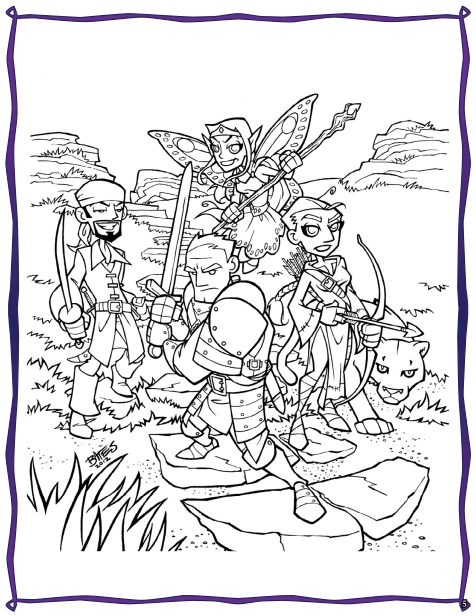

# Bienvenue à PremièreFable !

Si vous lisez cela, il y a de grandes chances que vous vouliez initier des enfants à la joie du jeu de rôles. Quand les joueurs de jeu de rôles deviennent plus vieux, qu'ils ont des enfants et qu'ils les voient grandir, il est naturel que nous voulions initier les personnes que nous aimons le plus au hobby que nous aimons le plus.

Mais est-ce réellement si simple ?

## Les enfants et le jeu libre

Cela peut l'être. Les enfants sont des joueurs de jeux de rôles naturels parce qu'ils font semblant intuitivement. Les bénéfices du jeu libre, c'est-à-dire du jeu sans règles ni attendus, sont indiscutables. Le jeu libre aide les enfants à traverser les périodes d'anxiété, à se mettre dans des situations sociales précises (ou même à les répéter), et, sans doute ce qui est le plus important, cela les aide à communiquer.

Les jeunes enfants devraient (ou doivent) avoir l'opportunité de jouer librement, malgré certains parents qui ont une tendance à surcharger les agendas des enfants avec des lecons et des activités de toutes sortes (le but n'étant pas de dire qu'envoyer vos enfants en cours de piano ou en colonie est une mauvaise idée, loin de là, mais qu'il est nécessaire à vos enfants d'avoir du temps libre et non structuré).

Quand les enfants grandissent, leur désir de jeu ne décroît pas, mais il devient plus sophistiqué. Comme enfants de rôlistes, ils ont probablement vus leur mère et leur père jeter des dés bizarres et brillants sur des grandes tables ou bouger ce qui ressemble à des petits jouets sur des cartes, et ils ont probablement été intrigués.

## Des jeux de rôles trop complexes

Mais la triste vérité est qu'un grand nombre de jeux de rôles, et spécialement les plus vieux qui sont plus proches des wargames et qui ont donné le jour à cette activité, sont complexes, ésotériques, et, pour un enfant, très ennuyeux. Et les nouveaux jeux de rôles basés sur des histoires, bien que plus simples au niveau des règles, ne fournissent pas assez de structure. Pour un enfant typique en phase de développement, avec un vocabulaire décent et une appropriation correcte des mathématiques de son âge, y a-t-il un jeu sur le marché qui pourrait être utilisé ?

Hé bien, oui, il y en a en fait plusieurs. PremièreFable est l'un d'entre eux. PremièreFable est spécialement conçu pour jouer avec des enfants de 8 à 12 ans, mais vous pourriez probablement descendre jusqu'à 6 ans (nous savons qu'il n'y a pas de limite supérieure d'âge dans le jeu de rôle).

## Un temps de jeu de 2 heures environ

Les histoires dans PremièreFable sont faites pour être jouées en environ deux heures, et le "maître du jeu" est supposé être un adulte alors que les joueurs sont des enfants. Le titre pour le maître du jeu dans PremièreFable est, en fait, simplement "la Grande Personne" (ou GP pour faire simple).

PremièreFable, comme la plupart des jeux de rôles, ne propose pas de moyens pour "gagner". Le jeu est coopératif, non compétitif, et tout le monde "gagne" en s'amusant. Sur cet aspect, le jeu de rôle ressemble beaucoup plus au jeu libre que je mentionnais ci-dessus que les jeux de plateau ou les jeux collectifs qui ont des règles définies.

## Le jeu PremièreFable

Le reste de ce livre explique comment paramétrer les personnages et comment le système de jeu fonctionne. Nous fournissons aussi des conseils pour mener le jeu, garder les joueurs impliqués, et s'assurer que tout le monde s'amuse. Enfin, nous finissons ce livre avec [La chasse au Dahu sauvage](05-La-chasse-au-Dahu-sauvage.md), une quête pour 4 joueurs impliquant la découverte de cette bête mythique.

Pour jouer avec PremièreFable, vous aurez besoin :

* De ce livre,
* D'une poignée de dés à 6 faces (vous pouvez vous procurer ces dés dans beaucoup de magasins standards ou vous pouvez acheter des jolis dés de toutes les couleurs dans les magasins de jeux, l'amour des dés multicouleurs commence tôt !),
* De copies des Livres de Personnages,
* Et de feuilles de personnages.

