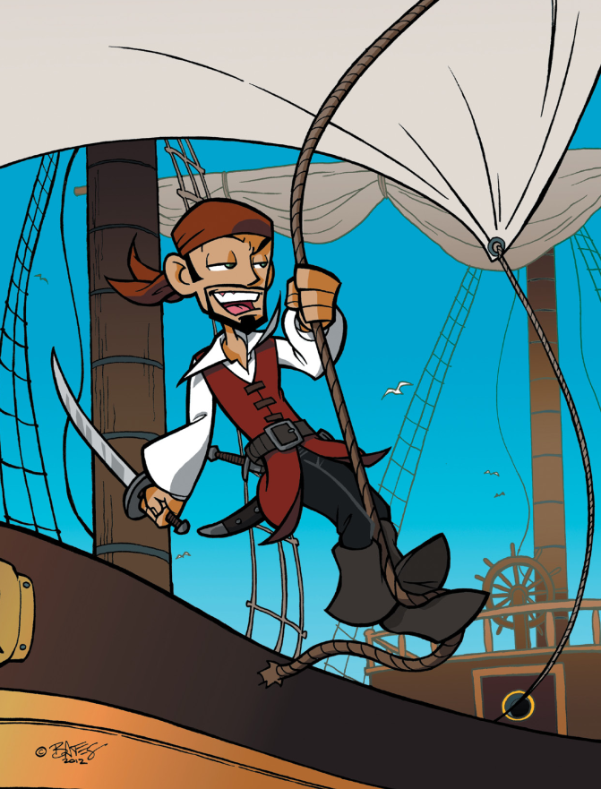
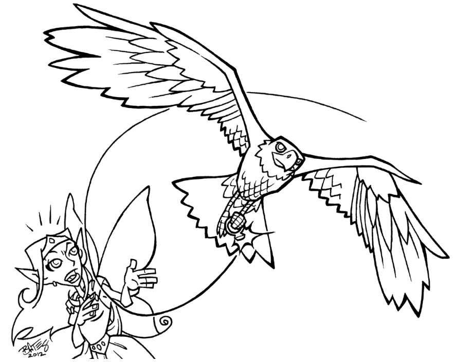

# Règles du jeu

Les règles du jeu de PremièreFable sont simples. Tout ce qu'un personnage peut vouloir faire dans le jeu sera soit une Tâche, soit un Défi. Les dés sont impliqués uniquement quand un personnage entre dans un Défi, c'est pourquoi nous commencerons par expliquer les Défis.

## Les Défis

Un personnage entre dans un défi quand il ou elle tente de faire quelque chose d'important qui peut potentiellement changer le cours de l'histoire, et qui a une chance non négligeable de mal se passer.

Quand un personnage entre dans un Défi, la GP décide quelle caractéristique est impliquée. Le joueur décide si un Talent ou le Point Faible s'applique (même si la GP peut avoir le dernier mot) et le joueur fait le calcul suivant :

* Nombre de dés à lancer : **Caractéristique + Talent - Point faible**

Chaque dé qui totalise plus de 4 est une **Etoile**. Le plus le jouer obtient d'Etoiles, meilleur est le résultat. Cela implique que si le joueur tire une seule Etoile, le personnage réussit le Défi mais de justesse. Si le joueur tire 3 Etoiles, le succès est complet. Si le joueur tire 5 Etoiles ou plus, le personnage éblouit tout le monde.

Une autre règle à propos des Etoiles est très importante. Elle est dénommée la règle de **Progression**. Si vous avez une Etoile pour tous vos dés, alors soit :

* Vous gagnez un nouveau Talent avec un score de 1 ;
* Vous ajoutez 1 à un Talent existant.

En revanche, si je jouer ne tire aucune Etoile, le personnage ne parvient pas à accomplir ce qu'il ou elle tentait, et quelque chose s'est mal passé, compliquant la situation pour le personnage.

### Exemple de Défi

Teagan joue son Amoureuse des Animaux, Ruby. Elle pourchasse un vilain petit garçon dans les bois à la demande de la mère du garçon (qui ne parvient pas à maîtriser le petit voyou). Teagan indique que Ruby a courir après le garçon le plus vite possible. Il faut naturellement faire un jet de Vitesse. Ruby a aussi un Talent "Galoper" qui est applicable, ce qui lui ajoute un dé. Le nombre de dés qu'elle doit alors jeter est de 3 : Vitesse (2) + Galoper (1) = 3.

Teagan lance les dés. Elle ne peut pas faire mieux que 3 Etoiles, bien entendu mais elle a de bonnes chances de réussir. Ce devrait être normalement un **Face à Face** [[4](98-Notes-du-traducteur.md#note4)] (comme c'est une course, voir plus bas), mais la GP décide que Ruby ne souhaite que de garder le garçon dans son champ de vision. C'est donc bien un Défi.

_Cas n°1 : Echec_

Teagan obtient 2, 2 et 3. Elle n'obtient aucune Etoile. Elle court dans les bois, mais le garçon est déjà caché. Désormais, elle aura sans doute un jet d'Intelligence à faire pour le trouver.

_Cas n°2 : Succès_

Teagan obtient 4, 1 et 5. Obtenant 2 Etoiles, Teagan réussit. Le garçon court dans les bois, mais Ruby est sur ses Talons. Elle peut maintenant lui crier de s'arrêter et le garder dans son champ de vision. Il pourrait s'arrêter suivant le type d'aventure prévu par la GP.

## Les Face à Face

Les Face à Face sont des Défis dans lesquels un personnage est directement en compétition contre un autre. Dans ce cas, les deux joueurs lancent les dés, et celui qui a le plus d'Etoiles gagne (souvenez-vous qu'une Etoile est un dé de valeur 4, 5 ou 6). Comptez combien d'Etoiles ont été obtenues par chacun des adversaires et soustrayez le nombre le plus faible du nombre le plus fort pour estimer l'amplitude de la victoire.

### Exemple de Face à Face

Blake, un Pirate, est engagé dans une dispute avec Roland, un Chevalier, à propos de savoir qui est le plus fort. Ils décident de soulever un rocher lourd et de le tenir au dessus de leur tête le plus longtemps possible pour le savoir. Le joueur de Roland lance 5 dés correspondant à sa Force (4) + Gros Bras (Talent de niveau 1). Blake lance 4 dés correspondant à sa Force (3)  + Sournoiserie (son Talent de niveau 1). Le joueur de Blake a convaincu la GP qu'il prendrait un rocher légèrement plus petit mais qu'il le tiendrait comme s'il était plus lourd, ce qui a permis l'utilisation du Talent  Sournoiserie dans le Face à Face. Les deux joueurs lancent leurs dés.

_Résultat n°1_

Le joueur de Blake obtient 3, 2, 4 et 5 et le joueur de Roland obtient 1, 1, 4, 4 et 6. Le joueur de Roland gagne d'une Etoile et donc Roland tient le rocher un peu plus longtemps que Blake.

_Résultat n°2_

Le joueur de Blake obtient 4, 4, 2 et 3 et le joueur de Roland obtient 3, 2, 4, 1 et 5. Les deux joueurs ayant le même nombre d'étoiles, les personnages lâchent le rocher en même temps. Ils auront besoin d'un autre Face à Face  s'ils veulent déterminer le vainqueur, où ils peuvent juste continuer à argumenter sur qui est le plus fort, ce qui paraît plus amusant.

_Résultat n°3_

Le joueur de Blake obtient 4, 4, 5 et 4 et le joueur de Roland obtient 3, 4, 4, 5 et 6. Les deux joueurs obtiennent 4 Etoiles, mais pour Blake, c'est une Progression. Blake tient son rocher pendant un long moment, même s'il est clair que Roland était plus fort et que l'exercice lui était plus facile. Quand ils lâchent enfin le rocher, tous les spectateurs les congratulent et sont stupéfaits de l'endurance de Blake. Le joueur de Blake ajoute "N'abandonne jamais 1" comme nouveau Talent lié à la Force.

## Les tâches

Une Tâche est une simple action qui fait avancer l'histoire, mais c'est quelque chose que le personnage peut faire relativement facilement. Puisqu'aucun dé n'est jeté, le personnage ne doit pas compter les Etoiles et n'a aucune chance d'augmenter un Talent.

Les Tâches peuvent mettre en place un Défi, et elles peuvent même aider un personnage avec un Défi. Si un personnage accomplit une tâche qui rend plus facile le Défi, le joueur du personnage gagne un dé supplémentaire pour le Défi en question.

### Exemple de Tâches

Sela, une Princess Fée, a rejoint Blake, Roland et Ruby dans leur quête pour sauver le petit garçon enlevé par des gobelins. Le groupe, en s'aventurant dans les bois gobelins, se retrouve face à un buisson de ronces. Sela est minuscule et peut donc passer au travers facilement, mais les autres personnages devront relever un Défi (soit basé sur la Force pour passer au travers, soit basé sur la Vitesse pour se faufiler adroitement au travers).

Le joueur de Sela demande si elle peut aider les personnages en les guidant, prenant la Tâche de trouver les endroits où les épines sont les moins denses. Cela fait gagner un dé supplémentaire aux joueurs devant relever le Défi d'avancer dans les épines. Si les personnages étaient poursuivis par un gobelin agressif à ce même moment, le fait que Sela accomplisse cette Tâche pourrait s'avérer être une aide précieuse.

## Les Trucs Spéciaux

Les Trucs Spéciaux sont polyvalents et sont très amusants. Cela signifie que les joueurs vont vouloir les utiliser aussi souvent qu'ils le peuvent. Il n'y a pas de problème à utiliser les Trucs Spéciaux lors de l'accomplissement des Tâches, et un joueur n'a pas de milite sur son nombre d'utilisations.

Pour autant, utiliser un Truc Spécial pour un Défi est différent. Chaque Truc Spécial a un score en nombre d'Etoiles. Ceux que les joueurs prennent à la création du personnage ont 5 Etoiles. Quand un joueur décide d'utiliser un Truc Spécial pour relever un Défi, il ou elle peut décider du nombre d'Etoiles à utiliser, en fonction de l'aide qu'il compte obtenir de son Truc Spécial. Le joueur peut décider de lancer les dés et d'ajouter les Etoiles du Truc Spécial, ou il peut juste laisser les Etoiles du Truc Spécial faire le travail (parfois, il se peut qu'il n'y ait pas de choix et que le personnage soit obligé de ne pas participer au Défi).

Une fois que toutes les Etoiles du Truc Spécial ont été consommées, le joueur ne peut plus utiliser le truc Spécial durant l'aventure. Néanmoins, le joueur peut continuer à utiliser le Truc Spécial pour les tâches, et parfois, le personnage pourra trouver un moyen de "recharger" des Etoiles du truc Spécial.

Certains Trucs Spéciaux disparaissent complètement une fois que toutes les Etoiles ont été consommées. C'est le cas des potions par exemple ; une fois que le personnage a bu une potion, cette dernière a disparu et ne peut plus être réutilisée.

### Exemple de Trucs Spéciaux

_Exemple n°1_

Ruby est dans les bois, à la recherche de l'enfant perdu, quand un ours affamé s'approche. Elle a peur, mais elle sait que l'ours ne l'attaquera pas si elle sait se rendre effrayante. Elle se met sur la pointe des pieds et hurle en direction de l'ours. La GP décide qu'un Face à Face de Force est requis. L'ours a une Force de 5 et Teagan, qui est inquiète car Ruby n'a qu'une force de 3, décide d'utiliser son Truc Spécial : Flamboyante, le chat des bois au grognement puissant. Flamboyante a 5 Etoiles pour l'aventure complète, et Teagan ne veut pas toutes les utiliser maintenant, et elle ne souhaite pas se battre avec l'ours. Elle utilise 2 Etoiles de Flamboyante et fait son jet de Force. Elle bat l'ours de une Etoile et l'ours se retire. Il reste maintenant 3 Etoiles à Flamboyante pour le reste de l'aventure.

_Exemple n°2_

Roland, le Chevalier, chevauche dans un pré avec un message pour son seigneur. Il entend un enfant pleure et comme c'est un preux chevalier, il décide de tenter d'aider. Il sort son Epée Magique de son fourreau (son Truc Spécial) et la pointe sur le proche Bois des Gobelins, disant à son épée "Montre-moi l'enfant qui pleure !" La GP décide que c'est une Tâche à accomplir : l'enfant n'est qu'à une courte distance à l'intérieur du bois, et Roland pourrait facilement le voir s'il passait le premier bosquet sur son cheval. L'épée se met à briller et les branches s'écartent légèrement, laissant Roland voir l'enfant. Le joueur de Roland n'a pas dépensé une seule Etoile de l'Epée Magique.

_Exemple n°3_

Blake, Le Pirate, est en visite chez sa mère quand son petit cousin disparaît dans le Bois des Gobelins.Blake se dit qu'il retrouvera bien son chemin pour rentrer, mais sa mère l'avertit que le Bois des Gobelins est un endroit dangereux et mystérieux. Le Tric Spécial de Blake est L'OEil de la Mer, une perle magique qui permet à Blake de voir des choses très lointaines. Blake soulève la pierre et regarde à l'intérieur, voulant voir le destin du garçon si lui-même n'aide pas.

Ce n'est pas quelque chose que Blake peut faire de lui-même et par conséquent, il ne peut qu'utiliser des Etoiles de son Truc Spécial. Le joueur de Blake décide qu'une Etoile est probablement suffisante pour une situation comme celle-ci. La GP décrit la lente transformation du garçon en gobelin. Blake, horrifié, prend sa dague, enfile ses bottes, et court en direction du Bois.

## Le Combat

Un **Combat** est un type spécial de Défi. Un combat survient quand un personnage tente de blesser quelqu'un ou qu'il tente de protéger quelqu'un afin de lui éviter d'être blessé.

> **Les combats réels**
> 
> Comme nous le savons tous, dans les combats réels, les gens sont blessés et meurent. Dans les films et à la télévision, un petit coup sur la tête et les gens sont "assommés", juste pour pouvoir se réveiller plus tard sans le moindre problème. Les gens se battent à l'épée ou au couteau, ou se battent avec de la magie, et, sauf si cela a un intérêt dramatique, personne n'est vraiment blessé.
> 
> Des choses de ce genre sont ce que l'on appelle communément un cliché. Ce n'est pas comme cela que les choses sont vraiment dans la réalité, et il est bien que les joueurs s'en rendent compte. Mais d'un autre côté, jouer des scènes de combat peut être amusant. Faut-il en avoir honte ?
> 
> Nous parlons un peu plus de la manière avec laquelle diriger des combats dans la section pour Grandes Personnes, ci-dessous, mais pour le moment, retenez juste que nos règles de Combat sont moins à propos de *causer des dommages* qu'à propos de *résoudre des Défis*.

Les Combats sont presque comme des Face à Face. Ils utilisent généralement Force ou Vitesse (il n'est pas impossible pour quelqu'un d'utiliser Intelligence dans un Combat, spécialement lors de l'utilisation de la magie, mais la chose est peu commune ; normalement, les Combats sont des sujets impliquant les corps et non les esprits). Les personnages dans des combats peuvent être soit des attaquants, soit des défenseurs.

Un *attaquant* utilise la Force si il ou elle utilise une massue, une grande hache, ou tout autre grande arme difficile à manier, s'il ou si elle lance un rocher, s'il ou si elle tente de frapper ou de lutter avec son opposant.

Un *défenseur* utilise la Force s'il ou si elle tente d'ignore les **Dommages**, de faire fi des blessures plutôt que de les éviter.

Un *attaquant* utilise la Vitesse si il ou elle fait des attaques rapides et ciblées, lançant des petits objets ou utilisant une arme légère de type dague ou fouet.

Un *défenseur* utilise la Vitesse pour esquiver les attaques.

Au début d'un Combat, tous les personnages décident de combien d'Etoiles ils sont prêts à prendre en tant que Dommages avant de quitter le Combat. Ce nombre est appelé les Dommages. Chaque joueur inscrit cette valeur sur un morceau de papier (le haut de la feuille de personnage fait bien l'affaire).

Durant le Combat, si l'attaquant gagne, le défenseur doit retrancher de ses Dommages le nombre suivant :

* Nombre d'Etoiles de l'attaquant - Nombre d'Etoiles du défenseur

Une fois que le défenseur a encaissé un nombre d'Etoiles correspondant à ses Dommages, le défenseur sort du Combat. Cela signifie que le personnage est assommé, ou apeuré, ou a abandonné, ou toute autre raison que je jouer verra comme appropriée.

Les joueurs peuvent fixer leurs Dommages à la valeur suivante :

* Dommages maximum = Somme de toutes les Caractéristiques + Somme de tous les Talents

Pour un nouveau personnage, le maximum de Dommages pouvant être fixé dans un Combat est 12 (9 pour les Caractéristiques et 3 pour les Talents. Mais fixer les Dommages aussi haut est risqué, car si un personnage endure plus de dommages que le maximum de son score dans une Caractéristique ou un Talent, le personnage devient **Blessé**.

Les personnages Blessés :

* Perdent 1 dé pour tous leurs Défis ;
* Gagnent un Point Faible supplémentaire, basé sur la manière avec laquelle ils ont été blessés.

Cependant, les personnages peuvent éviter d'être blessés. Si le personnage fixe ses Dommages à 3 (plus bas que sa Caractéritique la plua haute), alors le personnage sortira du combat après avoir encaissé 3 Dommages seulement. Comme ce score est plus bas que la plus haute Caractéristique pour un personnage débutant, ce n'est pas suffisant pour se faire blesser.

Un personnage peut choisir de sortir du combat à tout moment, mais une fois que les dés sont lancés, les résultats sont appliqués. Cela signifie qu'un joueur ne peut pas lancer des dés pour se défendre, ne pas obtenir d'Etoiles et ensuite sortir du Combat sans conséquence.

Les personnages peuvent se défendre contre toutes les attaques simultanées, mais ils n'ont droit qu'à une seule attaque par **Round**. Un *Round* se termine quand tous les personnages du Combat ont fait une attaque, et tous les Dommages ont été calculés et appliqués.

Un personnage avec un Truc Spécial capable d'attaquer de son propre chef (comme un animal de compagnie) peut faire une seconde attaque *ou* additionner des Etoiles en provenance du Truc Spécial à l'attaque du personnage. Cependant, si le truc Spécial mène sa propre attaque, le défenseur a droit à une défense.

### Exemple de combat

Roland, Sela, Ruby et Blake se retrouvent ensemble dans le Bois des Gobelins et recherchent le petit garçon fuyard (qui s'est avéré être le cousin de Blake). Ils découvrent que le garçon a été enlevé par des gobelins, et les personnages doivent le trouver avant qu'il ne se transforma, à son tour, en gobelin ! Alors qu'ils se frayent un chemin dans un buisson de ronces, ils tombent face à face avec un gobelin voûté vêtu d'une toge : un sorcier gobelin. Il agite ses doigts en direction des personnages et leur demande de partir. "L'enfant est à nous maintenant !"

"Ha !" dit Roland, qui charge en sortant son épée. La GP demande à Roland s'il veut juste effrayer le sorcier ou combattre. Le joueur de Roland dit qu'il veut se battre, ce qui fait que la GP demande aux joueurs de déterminer leurs Dommages.

Le joueur de Roland fixe ses Dommages à 6, ce qui est risqué car Roland pourrait être blessé. Le joueur de Ruby positionne ses Dommages à 3, le joueur de Blake à 4 et leur joueur de Sela à 1. La GP fixe les dommages du sorcier gobelin à 5.

Au premier round, Roland attaque le sorcier. Il lance Force 4 + Combat à l'Epée 1 = 5 dés. La GP lance pour le sorcier Vitesse 4 + Distraction Magique 2 = 6 dés. Roland obtient 3 Etoiles et la GP 2. Le sorcier prend une étoile de Dommages. S'il en prend encore 4, il est hors combat. Roland découpe le vêtement du Sorcier avec sa lame. "Maintenant, scélérat, dit Roland, où est le garçon ?"

Le sorcier grogne "*chetz wubba !*" (aucun personnage ne parle gobelin, mais cela sonne vraiment très désagréablement) et jette une boule de feu au groupe. Parce que le gobelin utilise son Truc Spécial (Magie des Gobelins), la GP dit au groupe qu'il les attaque tous d'un seul coup. La GP tire pour le sorcier Vitesse 4 et ajoute 3 Etoiles du Talent Magie des Gobelins.

Les joueurs se défendent. Roland décide de rester là et d'encaisser, espérant que son armure ne le sauve (son joueur fait un jet de Force 4) Blake, Sela et Ruby décide d'esquiver en faisant un jet de Vitesse. Tout le monde fait son jet et compare les résultats. La GP jette une seule fois les dés et compare ses résultats avec les joueurs.

Sela prend une Etoile de Dommage, et elle sort donc du Combat puisque c'est tout ce qu'elle pouvait encaisser. Son joueur décide que ses ailes sont légèrement brûlées, et elle chute sur le sol, confuse.

Blake fait un bon jet, et ne prend aucune Etoile de Dommage. Il esquive clairement et se sauvegarde.

Ruby prend deux Etoiles de Dommages, mais elle peut encore en prendre une avant de sortir du Combat. Le feu brûle un peu sa chemise, mais elle appelle Blaze à ses côtés pour préparer son attaque.

Le pauvre joueur de Roland, lui, n'obtient aucune Etoile sur son jet de défense. La boule de feu atteint Roland avec une pleine puissance, l'assommant et brûlant son armure ! Il prend 4 Etoiles de Dommages. Il est hors combat et il est blessé. Il pend une pénalité de -1 dé sur tous les Défis à venir tant que quelqu'un ne l'a pas soigné, et il prend un nouveau Point Faible jusqu'à la fin de l'aventure. La GP décide que ce Point Faible sera la Vue : le feu a brûlé son visage et ses yeux ont été touchés.

Le combat fait rage mais maintenant, seuls Blake et Ruby se battent contre le sorcier. Pour autant, le sorcier n'a plus que 2 Etoiles restant en Magie des Gobelins, et Blake et Ruby sont des combattants de bon niveau.

