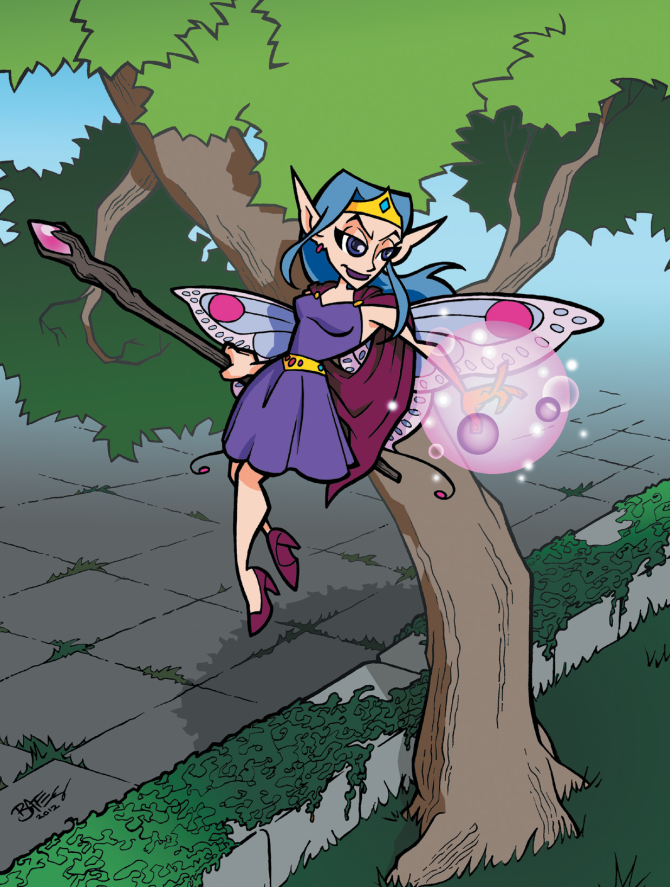

# Gérer le déroulement du jeu

Gérer le déroulement d'un jeu PremièreFable signifie prendre le rôle de la Grande Personne. Le choix du titre est délibéré, partiellement parce que nous voulions éviter le terme "Maître du jeu" (qui sonne un peu maniaque du contrôle) et partiellement parce nous voulions introduire ce rappel. Si vous gérez le déroulement du jeu, alors, vous êtes la Grande Personne. Cela signifie que vous devez vous assurer que tout le monde passe du bon temps, vous devez vous assurer que les conflits entre les joueurs ne d'enveniment pas au point de heurter les sensibilités des uns et des autres, et surtout, vous devez vous souvenir que vous n'êtes pas concerné. Heureusement, si vous êtes un parent, vous êtes probablement familiers avec tout cela.

D'autres jeux de rôles et diverses sites Internet proposent de nombreux bons conseils pour gérer le déroulement des jeux, et si vous avez déjà géré des jeux auparavant (ou même joué à quelques uns), vous connaissez sûrement les bases.

De ce fait, nous allons garder cette section brève et ciblée. Voici les 10 COMMANDEMENTS POUR ETRE LA GRANDE PERSONNE...

## 1. Restez en mouvement

Les enfants passent une grande partie de leur temps assis à des bureaux. Ne leur rappelez pas l'école. Quelque chose *devrait* se passer. Si rien ne se passe, sautez directement au passage où quelque chose se passe. "Marcher dans les bois" n'est pas intéressant à moins que les joueurs ne le rende intéressant (voir point suivant). Sentez-vous libres de dire "Et donc, vous marchez tous pendant un peu de temps jusqu'à ce que vous rencontriez..." quelque soit l'intérêt du développement suivant de l'aventure.

## 2. Laissez parler les personnages

Si les joueurs parlent au nom de leur personnage, laissez-les faire. Ne les ennuyez pas. Laissez faire aussi longtemps que nécessaire. Si les personnages commencent à se disputer, tentez de tout boucler sans que rien de mal n'arrive (personne ne devrait être blessé dans une dispute entre personnages joueurs), mais s'ils sont en interaction et qu'ils s'amusent, vous n'avez pas besoin d'être impliqué, à moins que vous jouiez un animal de compagnie ou une chose de ce genre. Si les joueurs parlent en dehors de leur personnage, redirigez-les vers la bonne voie. Ne les laissez pas se moquer les uns des autres.

## 3. Apprenez à faire des choses en parallèle

Le groupe se sépare toujours. Ce n'est pas une mauvaise chose : se séparer permet de couvrir plus de terrain, d'utiliser des méthodes dans lesquelles les personnages sont bons et de rendre le jeu pus tendu et plus amusant. Mais vous ne pouvez pas ignorer un groupe pendant une heure pendant que vous allez de Défi en Défi avec le premier groupe. Voici une bonne règles empirique : finissez un défi avec un groupe ou un personnage, puis passer au suivant. Si vous atteignez un point où le groupe ou le personnage sentent qu'une musique dramatique serait la bienvenu (tin-tin-tinnn), c'est le bon moment pour passer à un autre groupe. Ou si vous voyez un joueur piquer du nez, ou avoir l'être de s'ennuyer ou au contraire être agité, passez à ce joueur !

## 4. Choisissez vos mots avec attentions

Quand vous demandez à un joueur ce que son personnage veut faire, pensez choix des mots et ordre des mots. Dire "que voulez-vous faire ?" met la pression aux joueurs. Dire "Voulez-vous que votre personnage monte à la corde ou crie pour obtenir de l'aide ?" aide le joueur à visualiser ce qui est en train de se passer, et à réaliser quelles sont ses options. Notez aussi que les enfants vont souvent choisir la dernière option proposée, à moins que votre ton de voix indique la première. Cela peut sembler être de la manipulation, et en un sens, ça l'est, mais cela vous aide aussi à guider l'histoire dans un sens non totalement trivial.

## 5. Apprenez à "lire" vos joueurs

Certains enfants peuvent s'assoir à une table et jouer à des jeux de rôle pendant des heures. Certains adolescents (et certains adultes aussi) ne tiennent plus en place après 20 minutes. Certains personnes ont besoin d'un livre à lire ou quelque chose à colorier ou à dessiner pendant que le jeu se déroule, même s'ils gardent leur attention (les Livres des Personnages sont conçus pour gribouiller et écrire durant le jeu). Certains ne peuvent pas être attentifs si quelque chose d'autre les distrait. Vous aurez besoin d'apprendre comment vos joueurs appréhendent l'espace de jeu et quelle attention vous devez accorder à chaque joueur pour qu'il ou elle reste dans le jeu. Une suggestion pour une règle dure et rapide : pas de bidules à la table de jeu. Pas de téléphones, de tablettes, d'ordinateurs ou quoi que ce soit avec un écran. Ils attirent l'attention comme des sangsues.

## 6. Aidez les joueurs à grandir comme acteurs

Note : acteur / roleplayer

Une leçon qui dérange beaucoup de joueurs est que les joueurs et les personnages ne connaissent pas toujours les mêmes choses. Le jouer du Chevalier peut savoir que le Pirate a volé le casque de son personnage, mais le personnage ne le sait pas, et donc, il ne devrait pas agi comme s'il le savait. cela peut être une dure leçon à apprendre (spécialement pour les jeunes enfants), et en tant que GP, vous devriez aider les joueurs à l'apprendre. "Comment ton personnage a eu cette information ?" pourrait avoir comme réponse "hé bien, en fait, il ne l'a pas" (auquel cas la leçon est comprise) ou "Parce que je l'entend cliqueter dans son sac à dos" (auquel cas, il est possible d'organiser un Défi pour voir si c'est vraiment le cas, ce qui est une forme de décompense de la créativité du joueur !).

## 7. Evitez la violence

Beaucoup de jeux de rôles sont extrêmement violents. Le jeu le plus populaire de tous les temps (Donjons et Dragons, NDT) récompense les personnages pour avoir tué des monstres et volé leurs trésors. Mais peu de jeux de rôles sont dépourvus de violence. PremièreFable n'a pas besoin d'être complètement non violent, mais regardez bien comment les règles de Combat fonctionnent. Chaque joueur peut décider de prendre un vrai risque au Combat. Même si un personnage est blessé, il est absolument impossible pour un personnage de mourir dans un Combat. Si vous voulez vraiment inclure la possibilité de mort violente, notre recommandation serait de dire que ce n'est qu'à la condition qu'un personnage mette toutes ses étoiles dans ses Dommages et qu'il les perde toutes qu'il puisse mourir. Mais réellement, est-ce nécessaire ? Ou est-ce que les joueurs peuvent se satisfaire de chasser les méchants, les assommer, les capturer ou autre façon de les bloquer, au lieu de les massacrer ? "Les gentils ne tuent pas" est une leçon parfaitement adaptée aux joueurs de Première Fable. A vous de l'enseigner !

## 8. Evitez les stéréotypes

Les films et la télévision nous présentent fréquemment des personnages archétypaux. Il est en effet très facile de tomber dans les clichés offensant. Parce que beaucoup de joueurs sont hétérosexuels, blancs et de sexe masculin, il est facile pour nous de colporter des stéréotypes offensant. Les enfants n'ont probablement pas le recul pour comprendre quand la GP joue un bandit gobelin avec un dialecte de la banlieue, mais ils risquent de prendre les choses pour argent comptant. N'allez pas dans le rire facile. Ne faites pas de blagues aux dépends d'autres ethnies, races ou orientations. Ne faites pas de la frêle demoiselle féminine la personne que le groupe doit sauver. Ne prenez pas le chemin le plus facile. Au lieu de cela, pensez à votre manière de remettre en cause ces stéréotypes et de surprendre les joueurs quand les choses ne se passent pas comme prévu.

## 9. Dites juste oui

Les joueurs auront des idées brillantes sur comment les choses doivent se passer. Parfois, ils auront des théories intéressantes concernant les plans du méchant ou le secret derrière le mystère, et parfois leurs théories seront plus intéressante que l'aventure que vous ou nous aurons créée. Utilisez les idées des joueurs. Si un joueur a une suggestion sur ce qui devrait arriver, et sur l'interprétation d'un jet de dés raté, ou qui devrait se cacher derrière la porte close, utilisez cette suggestion. Si les autres joueurs à la table entendent l'idée et disent "oh oui, c'est génial !", alors prenez la suggestion. Les jeux de rôles sont des histoires partagées que l'on raconte à plusieurs, ce qui veut dire que tout le monde devrait avoir voix au chapitre.

"Dites juste oui" vient du théâtre improvisé où chaque acteur accepte ce que les autres acteurs disent afin de garder le bon déroulement de l'histoire. Le consensus récompense la participation et la créativité. Rappelez-vous que ce sont des enfants qui découvrent la capacité de jouer. Vous n'êtes pas là pour les défier avec des rencontres diaboliques et récolter la mort de tout le groupe. Vous n'avez pas à vous en faire si les personnages deviennent surpuissants si vous dites "oui" à leurs idées merveilleuses quant aux nouveaux Talents ou aux Trucs Spéciaux. Dites juste oui et laissez tout le monde passer un bon moment.

## 10. Enseignez

Créez des aventures à propos de choses que vous connaissez. Utilisez des faits historiques. Introduisez des espèces d'animaux qui sont intéressantes à connaître. Incluez des énigmes que les joueurs ont la capacité de résoudre. Mélangez une part d'eau et deux parts d'amidon, mettez le mélange dans un bol et dites aux personnages qu'ils sont arrivés à un trou (trop grand pour pouvoir sauter au dessus) rempli de cette substance. C'est sans danger à toucher mais s'ils restent debout dessus, ils couleront (ce que les joueurs peuvent tester en appuyant doucement sur la substance). S'ils courent dessus (ce que les joueurs peuvent découvrir en tapant sur la substance), la substance supporte leur poids. Quelques minutes de recherche en ligne vous feront découvrir toutes sortes de truc similaires que vous pouvez intégrer dans un contexte fantastique et utiliser dans votre jeu PremièreFable. Ne laissez jamais passer la chance d'enseigner aux joueurs quelque chose d'intéressant.

