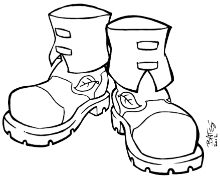
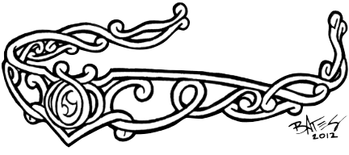
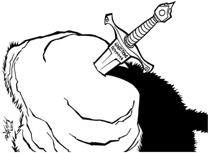

# Aventure : La chasse au Dahu sauvage

Dans cette aventure, les joueurs chassent une bête fantastique qu'ils n'ont jamais vue mais dont ils ont entendu parler toute leur vie. Durant le ours de l'venture, ils pourront découvrir des Trucs Spéciaux, relever des Défis et, de manière plus générale, être braves, héroïques et astucieux.

La bête mythique est dénommée le Dahu [[1](98-Notes-du-traducteur.md#note1)]. La zoologiste royale Edwina Darton, veut rien de moins que prouver son existence au Roi à l'ouverture du Jardin Zoologique Royal le mois prochain. Mais comme personne n'a jamais vu de ses yeux le Dahu, personne n'est certain de la manière requise pour en attraper un. C'est ici que les personnages interviennent.

## Démarrage

Les personnages sont ensemble près des bois. Il est tard dans l'après-midi et ils sont assis dans une prairie, près d'un ruisseau, se reposant pendant que leurs animaux de compagnie (s'il y en a) se rafraîchissent et boivent. Alors que les personnages sont en train de discuter, un vieil homme sur un âne arrive à leurs côtés.

Il apporte la nouvelle que le Jardin Zoologique Royal va ouvrir le mois prochain et que ce sera le cadeau d'anniversaire du Roi. La zoologiste royale, Edwina Darton, adorerait avoir un Dahu pour l'exposition. La conversation tourne sur le Dahu, et un des personnages (demandez pour un volontaire) dit : "J'ai entendu dire que le Dahu..."

A ce moment, faites le tour de la table et demandez à chaque joueur de fournir une information que leur personnage a entendue à propos du Dahu. La seule règle est que les informations ne peuvent pas se contredire (ce qui signifie que si un personnage a dit "j'ai tendu dire que le Dahu ne mangeait que des fleurs", le personnage suivant ne peut pas dire "j'ai entendu dire que le Dahu mangeait les gens".

Les joueurs ne le savent pas (bien qu'ils pourraient le suspecter) mais ils vont créer *leur propre version du Dahu* juste pour l'aventure. Ecrivez sur un papier ce qu'ils ont dit à propos du Dahu, et peut-être que tout le monde peut faire un dessin rapide de la bête. Quand tout le monde aura contribué, vous aurez créé votre version du Dahu, la bête que les personnages trouveront dans l'aventure.

*NDT : Si les joueurs connaissent le "vrai" [Dahu](https://fr.wikipedia.org/wiki/Dahu), vous pouvez les laisser inventer des choses à son propos. Dans ce cas, votre décor peut être vallonné. S'ils ne le connaissent pas, le Dahu qu'ils auront inventé être une tout autre bête.*

## Le début de la quête

Les personnages peuvent rester là, prés du ruisseau, aussi longtemps qu'ils le veulent, mais quand quelqu'un commence à s'éloigner, il trouve des traces qui pourraient appartenir au Dahu ! regarder les croquis et tenter de voir à quoi pourraient ressembler les traces.

Trouver et identifier les traces n'est pas un Défi, mais les suivre en est un (**Défi sur l'Intelligence**).

Les traces mènent dans les bois proches. Le vieil homme et son âne ont peut des bois, il ne les accompagnera donc pas, mais il les encouragera à y aller. "Je suis sûr que le docteur Darton vous donnera une récompense, même pour un simple dessin du vrai Dahu".

## Les Défis dans les bois

Les quatre événements suivants peuvent se produire dans n'importe quel ordre dans la quête du Dahu. Après chacun d'entre eux, un des personnages gagne un Truc Spécial. Cela signifie que vous devez vous assurez qu'un seul personnage ne monopolisera pas toute l'attention, et que tous les personnages auront la chance de faire des actions et de résoudre des problèmes.

Vus pouvez bien entendu créer de nouveaux Défis suivant ce que les personnages font et suivant la durée que vous voulez donner à l'aventure.

### Attention au loup

Les personnages sont dans les bois, suivant les traces et recherchant le Dahu, quand ils entendent un hurlement. Est-ce la bête ? Le Dahu qu'ils recherchent ? Non ! C'est un loup en colère !

**Loup**

Caractéristique | Force | Vitesse | Intelligence
---|---|---|---
**Score** | 4 | 3 | 1

Talents :

Talents | Score
---|---
Faire tomber les gens | 1
Grognement puissant | 1
Poursuivre des choses | 1
Pister | 1
Creuser | 1

Ce n'est pourtant pas une scène de combat. Si les personnages tentent d'en créer une, fixer les Dommages du loup à 2. Le loup a mal aux dents et il est juste énervé et grincheux.

Le réel Défi ici est de réaliser que le loup souffre (**Défi sur Intelligence**), en ensuite de lui enlever le morceau de bois qu'il a entre deux dents (**Défi sur la Force**).

Si les personnages y arrivent, le loup devient très amical envers le personnage qui lui a soigné sa dent ou envers celui qui lui a témoigné le plus de compassion. Il agit comme un Truc Spécial à 5 Etoiles et va faire des choses comme faire tomber des ennemis, poursuivre des choses pour le compte du personnage, et même autoriser un caractère de petit gabarit (comme un Prince ou une Princesse Fée) de le chevaucher.

Truc spécial | Effets | Etoiles
---|---|---
Loup | Animal de compagnie | 5

Il restera avec le personnage quand ses étoiles auront été consommées mais il ne quittera pas les bois (donc il ne restera pas avec le personnage à la fin de cette aventure, mais il pourrait le retrouver dans d'autres aventures localisées dans les mêmes bois). Si le personnage guide le chien vers les traces du Dahu, ce dernier peut les aider à pister la bête.

### Un voleur sournois

Tandis que les personnages cherchent le Dahu, ils peuvent entendre quelqu'un en train de grimper au dessus d'eux (Face à Face contre la Vitesse du bandit).

Si les personnages gagent, ils entendent Renyard, le voleur, et peuvent se préparer. S'ils perdent, Renyard les surprend et obtient la première attaque.

**Renyard, le voleur**

Caractéristique | Force | Vitesse | Intelligence
---|---|---|---
**Score** | 3 | 5 | 3

Talents :

Talents | Score
---|---
Pick pocket | 1
Enigmes | 1
Utiliser une corde | 1

Faiblesse :

Faiblesse | Score
---|---
Mathématiques | 1

Truc spécial | Effets | Etoiles
---|---|---
Bottes magiques | Sauter haut / courir vite | 3

Renyard est maigre, avec les cheveux roux et un sourire déviant. Il prévoit de voler les personnages et d'utiliser ses bottes pour s'enfuir. Ses bottes lui permettent de sauter incroyablement haut et de courir comme le vent. Ainsi, il planifie de sauter dans la cime des arbres pour s'échapper. Il ne souhaite pas Combattre (si les personnages veulent combattre, fixer ses Dommages à 1), donc le réel Défi ici est de le rattraper.

Le secret, ici, est que Renyard est en fait un renard. Il a été changé en personne pour avoir violé la Loi des Renards (si un personnage lui demande ce que c'est, il dira que c'est un secret et qu'il a compris la leçon). Si les personnages l'attrapent et enlèvent ses bottes, le charme est rompu, et Renyard redevient un renard. Il dit aux personnages qu'ils peuvent garder les bottes. Il n'en a plus besoin et la malédiction sur lui (qui l'empêchait de les enlever) a été bisée en même temps que le charme. Si les personnages demandent, Renyard leur indique la direction dans laquelle est le Dahu.

Les bottes magiques sont un Truc Spécial. Elles n'ont que 3 Etoiles et sont dédiées à courir vite et sauter haut. Le personnage qui a pris Renyard peut garder les bottes, même au delà de cette aventure.

### Les fées malicieuses

Les personnages prennent une mauvaise direction et se retrouvent dans un cercle de fées. Des petites fées espiègles les entourent, en dansant et en rayonnant et leur disent qu'elles ne les laisseront pas sortir tant qu'ils n'auront pas résolu une énigme. Si les personnages veulent sortir du cercle, il leur semble que le bord du cercle est à des kilomètres de distance ! (Si un des personnages est un Prince ou une Princesse Fée, le personnage peut peut confirmer que ce genre d'illusion est typique des petites fées espiègles, et qu'il vaut mieux juste entrer dans leur jeu.)

L'énigme est la suivante :

> Eté, Hiver, Printemps, Automne.
> Ce qui était en haut est maintenant en bas.
> Chêne, érable, herbe et trèfle.
> Que font-il quand l'été est fini ?

La réponse est : "les feuilles" ou "feuille". Vous pouvez laisser les joueurs en parler. Ils peuvent deviner autant de fois qu'ils le souhaitent. Les petites fées gloussent quand les personnages devinent mal.

Ils peuvent avoir des indices en relevant un **Défi sur l'Intelligence** : pour chaque Etoile, ils peuvent avoir une réponse oui ou non à une question.

Quand les personnages devinent la bonne réponse, les petites fées tournoient en riant et donnent au personnage qui a résolu l'énigme le Diadème de Vision.

Le Diadème est un Truc Spécial qui permet au personnage de voir au travers des objets solides. Le diadème reste avec le personnage qui l'obtient, même après la fin de l'aventure.

Truc spécial | Effets | Etoiles
---|---|---
Diadème de Vision | Voir à travers les objets solides / Voir dans le noir | 3

Les petites fées disent au personnage que le Diadème est magique et le laissera voir clairement et sans obstruction. Puis elles disparaissent dans un nuage de fumée brillante. Si le personnage demande, elles pointent la direction dans laquelle le Dahu peut être trouvé.

### Une épée dans la souche

En déambulant dans les bois, les personnages tombent sur une épée bloquée dans une souche d'arbre. L'épée et brillante et neuve et pas du tout rouillée mais est enfichée profondément dans la souche.

L'en sortir est un **Défi sur la Force**. Le personnage doit obtenir 5 Etoiles pour parvenir à retirer l'épée, mais il n'est pas obligé de les obtenir d'un seul coup. Le vrai Défi est de ne pas abandonner.

Si le personnage libère l'épée de la souche, cette dernière brille avec une lumière magique et pointe la direction dans laquelle est le Dahu.

Truc spécial | Effets | Etoiles
---|---|---
Epée magique | Coupe presque tout / Produit de la lumière magique pendant quelques secondes | 3

L'épée est un Truc Spécial à 3 Etoiles. En plus d'être assez coupante pour couper presque tout, elle peut produire de la lumière pendant quelques secondes. L'épée reste avec le personnage qui l'a sorti de la souche même après la fin de l'aventure.

## Trouver le Dahu

Quand les personnages ont terminé les Défis dans les bois, ils trouvent le Dahu. Le pauvre animal est coincé sous un arbre qui est manifestement tombé, et il ne peut plus bouger. Comment il agit dépend sans doute de ce qu'on imaginé les joueurs, mais il est probable qu'il ait peur.Le Dahu peut être capable de parler, auquel cas les personnages peuvent le raisonner et lui offrir leur aide.

Jouez cette partie comme une conversation. Avec un peu de chance, les personnages offriront de libérer de le Dahu, même s'ils ne savent pas si ce dernier viendra avec eux. Néanmoins, s'ils demandent gentiment, le Dahu acceptera de visiter le Zoo Royal et de rencontrer le Roi.

Enlever l'arbre qui bloque le Dahu requiert la participation de tous les personnages. Les Trucs spéciaux gagnés durant l'aventure pourraient aussi servir. Les bottes peuvent aider un personnage à sauter à la cime des arbres pour voir comment bouger au mieux  l'arbre. L'épée pourrait permettre de couper des branches. Le loup pourrait aider à soulever le tronc ou à creuser une tranchée pour libérer le Dahu. Un personnage pourrait utiliser le diadème pour voir au travers du tronc et comprendre où le couper ou par où le soulever.

Dans tous les cas, quand le Dahu est libre, il agit à l'image de ce que les personnages auront fait. Ils pourraient avoir envie de le capturer par la Force, auquel cas, il n'engage pas de Combat (il est trop faible) mais il pleure tristement quand il se fait attacher. Ils pourraient tenter de l'appâter jusqu'au zoo avec sa nourriture favorite, auquel cas il irait avec eux de bon cœur. Une Amoureuse des Animaux pourrait lui parler. Une nouvelle fois, il ira avec les personnages s'ils sont polis avec lui.

## Le Zoo

Les personnages sont présents à l'ouverture du Jardin Zoologique Royal. Ils sont amenés à rencontrer le docteur Edwina Darton qui ne cesse de les remercier d'avoir apporter le Dahu. Si le Dahu est triste d'être là, Le Roi décide de ne pas l'emprisonner et ordonne qu'on le libère dans les bois. On donne de l'argent aux personnages comme récompense mais cela ne se transforme pas en Truc Spécial. Le message est ici qu'ils ont bien travaillé mais qu'ils auraient dû travailler plus pour que le Dahu les suive de son plein gré.

Si le Dahu est d'accord pour être là ou content pour une autre raison, le Roi est enchanté du Dahu et il remercie des personnages. Il dit aux personnages qu'ils sont les bienvenus dans son Jardin aussi souvent qu'ils le souhaitent.

Chaque personnage gagne un Truc Spécial à une étoile : Ami du Roi.

Truc spécial | Effets | Etoiles
---|---|---
Ami du Roi | Aide précieuse | 1

C'est sans doute le point de départ de beaucoup d'aventures excitantes pour les personnages !

