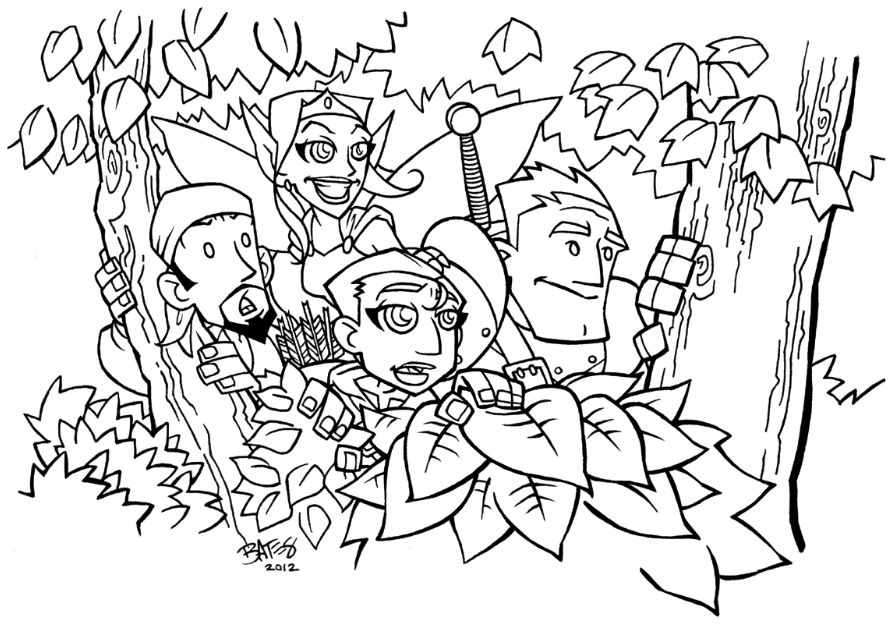

# Aventure : La chasse au Dahu sauvage

Dans cette aventure, les joueurs chassent une bête fantastique qu'ils n'ont jamais vue mais dont ils ont entendu parler toute leur vie. Durant le ours de l'venture, ils pourront découvrir des Trucs Spéciaux, relever des Défis et, de manière plus générale, être braves, héroïques et astucieux.

La bête mythique est dénommée le Dahu [[1](98-Notes-du-traducteur.md#note1)]. La zoologiste royale Edwina Darton, veut rien de moins que prouver son existence au Roi à l'ouverture du Jardin Zoologique Royal le mois prochain. Mais comme personne n'a jamais vu de ses yeux le Dahu, personne n'est certain de la manière requise pour en attraper un. C'est ici que les personnages interviennent.

## Démarrage

Les personnages sont ensemble près des bois. Il est tard dans l'après-midi et ils sont assis dans une prairie, près d'un ruisseau, se reposant pendant que leurs animaux de compagnie (s'il y en a) se rafraîchissent et boivent. Alors que les personnages sont en train de discuter, un vieil homme sur un âne arrive à leurs côtés.

Il apporte la nouvelle que le Jardin Zoologique Royal va ouvrir le mois prochain et que ce sera le cadeau d'anniversaire du Roi. La zoologiste royale, Edwina Darton, adorerait avoir un Dahu pour l'exposition. La conversation tourne sur le Dahu, et un des personnages (demandez pour un volontaire) dit : "J'ai entendu dire que le Dahu..."

A ce moment, faites le tour de la table et demandez à chaque joueur de fournir une information que leur personnage a entendue à propos du Dahu. La seule règle est que les informations ne peuvent pas se contredire (ce qui signifie que si un personnage a dit "j'ai tendu dire que le Dahu ne mangeait que des fleurs", le personnage suivant ne peut pas dire "j'ai entendu dire que le Dahu mangeait les gens".

Les joueurs ne le savent pas (bien qu'ils pourraient le suspecter) mais ils vont créer *leur propre version du Dahu* juste pour l'aventure. Ecrivez sur un papier ce qu'ils ont dit à propos du Dahu, et peut-être que tout le monde peut faire un dessin rapide de la bête. Quand tout le monde aura contribué, vous aurez créé votre version du Dahu, la bête que les personnages trouveront dans l'aventure.

*NDT : Si les joueurs connaissent le "vrai" [Dahu](https://fr.wikipedia.org/wiki/Dahu), vous pouvez les laisser inventer des choses à son propos. Dans ce cas, votre décor peut être vallonné. S'ils ne le connaissent pas, le Dahu qu'ils auront inventé être une tout autre bête.*

## Démarrage de la quête

Les personnages peuvent rester là, prés du ruisseau, aussi longtemps qu'ils le veulent, mais quand quelqu'un commence à s'éloigner, il trouve des traces qui pourraient appartenir au Dahu ! regarder les croquis et tenter de voir à quoi pourraient ressembler les traces.

Trouver et identifier les traces n'est pas un Défi, mais les suivre en est un (Défi basé sur l'Intelligence).

Les traces mènent dans les bois proches. Le vieil homme et son âne ont peut des bois, il ne les accompagnera donc pas, mais il les encouragera à y aller. "Je suis sûr que le docteur Darton vous donnera une récompense, même pour un simple dessin du vrai Dahu".

## Les Défis dans les bois

Les quatre événements suivants peuvent se produire dans n'importe quel ordre dans la quête du Dahu. Après chacun d'entre eux, un des personnages gagne un Truc Spécial. Cela signifie que vous devez vous assurez qu'un seul personnage ne monopolisera pas toute l'attention, et que tous les personnages auront la chance de faire des actions et de résoudre des problèmes.

Vus pouvez bien entendu créer de nouveaux Défis suivant ce que les personnages font et suivant la durée que vous voulez donner à l'aventure.

## Attention au loup

